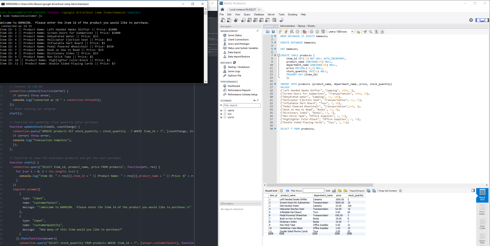

# Bamazon
Amazon-Like Storefront using MySQL

Currently, this app consists of a customer interface only (bamazonCustomer.js).  This is the interface a customer sees while interacting with the storefront.  Further updates will be added later for manager and supervisor level functionality.

1.  First, we see the console interface (top-left) where the user is prompted to enter the item ID of the desired item.  It is followed by the list of items with their item ID, Product Name, and Price.  The Database can be seen on the open MySQL workbench on the left.

2.  The user enters the desired item ID.

3. The user is prompted for the number of items the user wishes to purchase.

4. The database is queried again and shows the change in stock quantity for the item.

5. After the successful purchase, the user opts to purchase an item with zero items in the stock quantity.  They will be notified that there is an "Insufficient Quantity" of the item.

After each successful or unsuccessful purchase, the user is provided with the list of items and prompted to choose an item to purchase.
